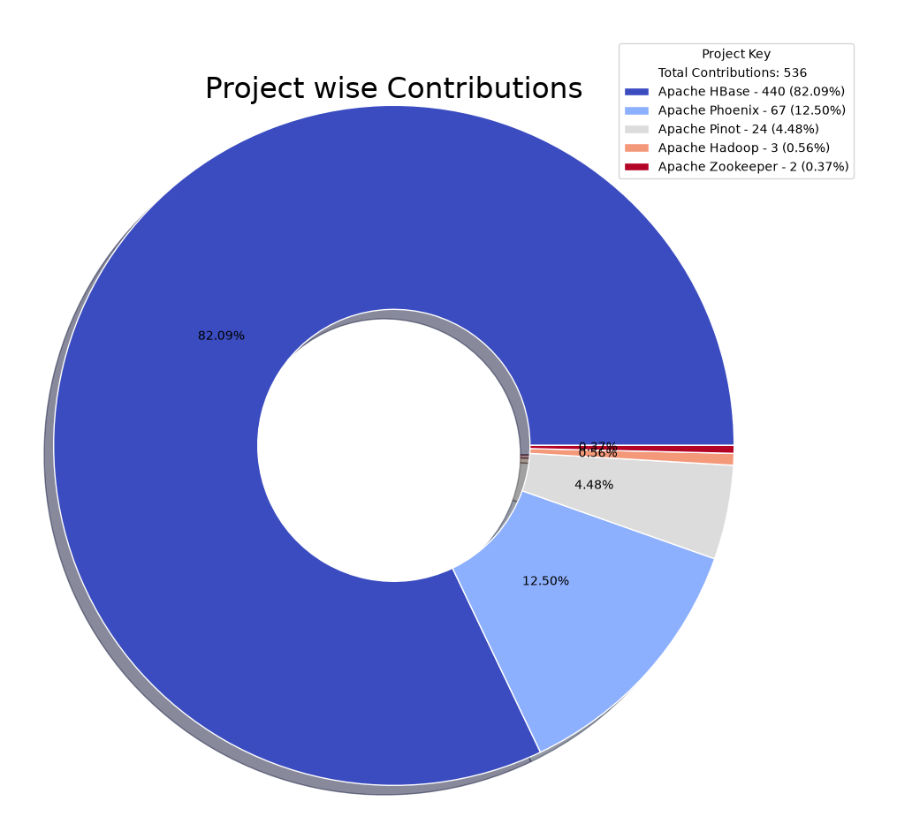
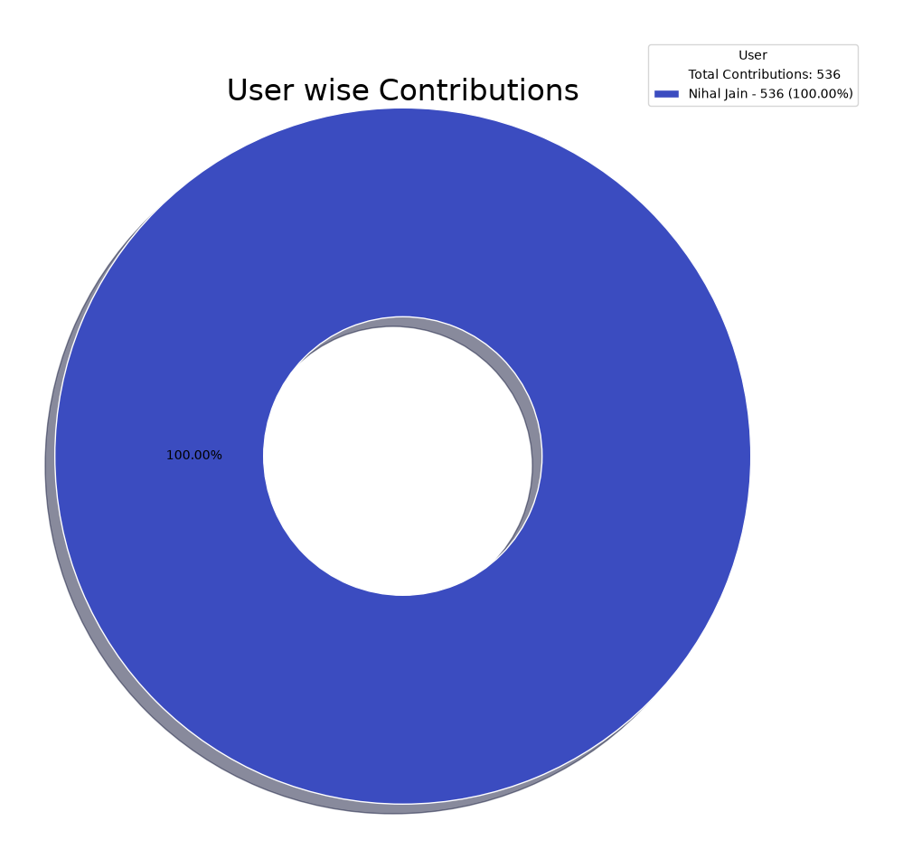

# OpenSource Contributions Report

*Report auto-generated on: 2026-05-03 03:35:37 for period 1970-01-01 to 2026-05-04*

## Overall Summary

| Metric | Value |
|--------|-------|
| Total number of projects | 5 |
| Total number of repositories | 12 |
| Total number of contributions | 533 |
| Number of commits to master* | 167 |
| Number of pull requests (Open)* | 10 |
| Number of pull requests (Closed) | 248 |
| Number of issues (Open)* | 4 |
| Number of issues (Closed)* | 5 |
| Total unique PRs reviewed* | 347 |

**Note:** Fields marked with * contribute to the total contribution count.

  
  

## Summary of Contributions by each project

| Project Key | Repositories | Users | Commits | Pull Requests (Open) | Pull Requests (Closed) | Issues (Open) | Issues (Closed) | Code Reviews | Overall Contribution |
|--------------|--------------|-------|---------|----------------------|----------------------|----------------|----------------|--------------|----------------------|
| Apache HBase |  [apache/hbase](https://github.com/apache/hbase)  [apache/hbase-connectors](https://github.com/apache/hbase-connectors)  [apache/hbase-operator-tools](https://github.com/apache/hbase-operator-tools)  [apache/hbase-thirdparty](https://github.com/apache/hbase-thirdparty) |  [Nihal Jain](https://github.com/NihalJain) | 129 | 8 | 194 | 0 | 0 | 300 | 437 |
| Apache Phoenix |  [apache/phoenix](https://github.com/apache/phoenix)  [apache/phoenix-omid](https://github.com/apache/phoenix-omid)  [apache/phoenix-queryserver](https://github.com/apache/phoenix-queryserver)  [apache/phoenix-thirdparty](https://github.com/apache/phoenix-thirdparty) |  [Nihal Jain](https://github.com/NihalJain) | 28 | 0 | 42 | 0 | 0 | 39 | 67 |
| Apache Pinot |  [apache/pinot](https://github.com/apache/pinot)  [pinot-contrib/pinot-docs](https://github.com/pinot-contrib/pinot-docs) |  [Nihal Jain](https://github.com/NihalJain) | 7 | 2 | 8 | 4 | 5 | 6 | 24 |
| Apache Hadoop |  [apache/hadoop](https://github.com/apache/hadoop) |  [Nihal Jain](https://github.com/NihalJain) | 1 | 0 | 2 | 0 | 0 | 2 | 3 |
| Apache Zookeeper |  [apache/zookeeper](https://github.com/apache/zookeeper) |  [Nihal Jain](https://github.com/NihalJain) | 2 | 0 | 2 | 0 | 0 | 0 | 2 |

## Summary of Contributions by each user

| User | Repositories | Commits | Pull Requests (Open) | Pull Requests (Closed) | Issues (Open) | Issues (Closed) | Code Reviews | Overall Contribution |
|------|--------------|---------|----------------------|----------------------|----------------|----------------|--------------|----------------------|
|  [Nihal Jain](https://github.com/NihalJain) |  [apache/hadoop](https://github.com/apache/hadoop)  [apache/hbase](https://github.com/apache/hbase)  [apache/hbase-connectors](https://github.com/apache/hbase-connectors)  [apache/hbase-operator-tools](https://github.com/apache/hbase-operator-tools)  [apache/hbase-thirdparty](https://github.com/apache/hbase-thirdparty)  [apache/phoenix](https://github.com/apache/phoenix)  [apache/phoenix-omid](https://github.com/apache/phoenix-omid)  [apache/phoenix-queryserver](https://github.com/apache/phoenix-queryserver)  [apache/phoenix-thirdparty](https://github.com/apache/phoenix-thirdparty)  [apache/pinot](https://github.com/apache/pinot)  [apache/zookeeper](https://github.com/apache/zookeeper)  [pinot-contrib/pinot-docs](https://github.com/pinot-contrib/pinot-docs) | 167 | 10 | 248 | 4 | 5 | 347 | 533 |

## Detailed Contributions

| Project Key | Repository | User | Rank | Commits | Pull Requests (Open) | Pull Requests (Closed) | Issues (Open) | Issues (Closed) | Code Reviews | Overall Contribution |
|--------------|------------|------|------|---------|----------------------|----------------------|----------------|----------------|--------------|----------------------|
| Apache HBase |  [apache/hbase](https://github.com/apache/hbase) |  [Nihal Jain](https://github.com/NihalJain) | 27 | 84 | 6 | 150 | 0 | 0 | 245 | 335 |
| Apache HBase |  [apache/hbase-connectors](https://github.com/apache/hbase-connectors) |  [Nihal Jain](https://github.com/NihalJain) | 7 | 8 | 0 | 10 | 0 | 0 | 19 | 27 |
| Apache HBase |  [apache/hbase-thirdparty](https://github.com/apache/hbase-thirdparty) |  [Nihal Jain](https://github.com/NihalJain) | 3 | 24 | 2 | 21 | 0 | 0 | 24 | 50 |
| Apache HBase |  [apache/hbase-operator-tools](https://github.com/apache/hbase-operator-tools) |  [Nihal Jain](https://github.com/NihalJain) | 5 | 13 | 0 | 13 | 0 | 0 | 12 | 25 |
| Apache Hadoop |  [apache/hadoop](https://github.com/apache/hadoop) |  [Nihal Jain](https://github.com/NihalJain) | N/A | 1 | 0 | 2 | 0 | 0 | 2 | 3 |
| Apache Phoenix |  [apache/phoenix](https://github.com/apache/phoenix) |  [Nihal Jain](https://github.com/NihalJain) | 40 | 12 | 0 | 27 | 0 | 0 | 30 | 42 |
| Apache Phoenix |  [apache/phoenix-omid](https://github.com/apache/phoenix-omid) |  [Nihal Jain](https://github.com/NihalJain) | 10 | 10 | 0 | 9 | 0 | 0 | 3 | 13 |
| Apache Phoenix |  [apache/phoenix-queryserver](https://github.com/apache/phoenix-queryserver) |  [Nihal Jain](https://github.com/NihalJain) | 4 | 5 | 0 | 5 | 0 | 0 | 5 | 10 |
| Apache Phoenix |  [apache/phoenix-thirdparty](https://github.com/apache/phoenix-thirdparty) |  [Nihal Jain](https://github.com/NihalJain) | 4 | 1 | 0 | 1 | 0 | 0 | 1 | 2 |
| Apache Pinot |  [pinot-contrib/pinot-docs](https://github.com/pinot-contrib/pinot-docs) |  [Nihal Jain](https://github.com/NihalJain) | 61 | 2 | 0 | 2 | 0 | 0 | 2 | 4 |
| Apache Pinot |  [apache/pinot](https://github.com/apache/pinot) |  [Nihal Jain](https://github.com/NihalJain) | 138 | 5 | 2 | 6 | 4 | 5 | 4 | 20 |
| Apache Zookeeper |  [apache/zookeeper](https://github.com/apache/zookeeper) |  [Nihal Jain](https://github.com/NihalJain) | 81 | 2 | 0 | 2 | 0 | 0 | 0 | 2 |

## Activity Details

###  [Nihal Jain](https://github.com/NihalJain)

#### Apache HBase

##### [apache/hbase](https://github.com/apache/hbase)

**Pull Requests**

| # | Title | Status | Created | Updated | Labels |
|---|-------|--------|---------|---------|--------|
| [#5019](https://github.com/apache/hbase/pull/5019) | HBASE-27626 Suppress noisy logging in client.ConnectionImplementation | ✅ Merged | 2023-02-09 | 2023-02-09 |  |
| [#5109](https://github.com/apache/hbase/pull/5109) | HBASE-27671 Client should not be able to restore/clone a snapshot aft… | ✅ Merged | 2023-03-15 | 2023-03-18 |  |
| [#5117](https://github.com/apache/hbase/pull/5117) | HBASE-27671 Client should not be able to restore/clone a snapshot aft… | ✅ Merged | 2023-03-17 | 2023-03-18 | backport |
| [#5118](https://github.com/apache/hbase/pull/5118) | HBASE-27671 Client should not be able to restore/clone a snapshot aft… | ✅ Merged | 2023-03-18 | 2023-03-20 |  |
| [#5173](https://github.com/apache/hbase/pull/5173) | HBASE-27791 Upgrade vega and its related js libraries | ✅ Merged | 2023-04-12 | 2023-04-18 |  |
| [#5176](https://github.com/apache/hbase/pull/5176) | HBASE-27792 Guard Master/RS Dump Servlet behind admin walls | ✅ Merged | 2023-04-13 | 2023-04-25 |  |
| [#5190](https://github.com/apache/hbase/pull/5190) | HBASE-20804 Document and add tests for HBaseConfTool | ✅ Merged | 2023-04-19 | 2023-04-23 |  |
| [#5215](https://github.com/apache/hbase/pull/5215) | HBASE-27814 Add support for dump and process metrics servlet in REST … | ✅ Merged | 2023-05-03 | 2024-02-29 |  |
| [#5217](https://github.com/apache/hbase/pull/5217) | HBASE-27792 Guard Master/RS Dump Servlet behind admin walls | ✅ Merged | 2023-05-03 | 2023-05-03 |  |
| [#5219](https://github.com/apache/hbase/pull/5219) | Add nihaljain to the developer list | ✅ Merged | 2023-05-03 | 2023-05-03 |  |
| [#5323](https://github.com/apache/hbase/pull/5323) | HBASE-27966 HBase Master/RS JVM metrics populated incorrectly | ✅ Merged | 2023-07-14 | 2023-08-21 |  |
| [#5359](https://github.com/apache/hbase/pull/5359) | HBASE-28032 Fix ChaosMonkey documentation code block rendering | ✅ Merged | 2023-08-18 | 2023-08-21 |  |
| [#5364](https://github.com/apache/hbase/pull/5364) | HBASE-27966 HBase Master/RS JVM metrics populated incorrectly | ✅ Merged | 2023-08-21 | 2023-08-29 | backport |
| [#5365](https://github.com/apache/hbase/pull/5365) | [DO_NOT_MERGE] HBASE-28035 ConnectionFactory.createConnection does not work with any… | 🔄 Open | 2023-08-21 | 2023-08-23 |  |
| [#5387](https://github.com/apache/hbase/pull/5387) | HBASE-28066 Drop duplicate test class TestShellRSGroups.java | ✅ Merged | 2023-09-06 | 2023-09-16 |  |
| [#5407](https://github.com/apache/hbase/pull/5407) | HBASE-28089 Upgrade BouncyCastle to fix CVE-2023-33201 | ✅ Merged | 2023-09-16 | 2023-09-20 |  |
| [#5415](https://github.com/apache/hbase/pull/5415) | HBASE-28089 Upgrade BouncyCastle to fix CVE-2023-33201 | ✅ Merged | 2023-09-20 | 2023-09-20 | backport |
| [#5422](https://github.com/apache/hbase/pull/5422) | HBASE-28089 Upgrade BouncyCastle to fix CVE-2023-33201 | ✅ Merged | 2023-09-20 | 2023-09-23 | backport |
| [#5423](https://github.com/apache/hbase/pull/5423) | HBASE-28089 Upgrade BouncyCastle to fix CVE-2023-33201 | ✅ Merged | 2023-09-20 | 2023-09-23 | backport |
| [#5425](https://github.com/apache/hbase/pull/5425) | HBASE-27991 [hbase-examples] MultiThreadedClientExample throws java.l… | ✅ Merged | 2023-09-21 | 2023-09-26 | backport |
| [#5434](https://github.com/apache/hbase/pull/5434) | HBASE-28110 Align TestShadeSaslAuthenticationProvider between differe… | ✅ Merged | 2023-09-24 | 2023-10-21 |  |
| [#5472](https://github.com/apache/hbase/pull/5472) | HBASE-24179 Backport fix for "Netty SASL implementation does not wait for challenge response" to branch-2.x | ✅ Merged | 2023-10-21 | 2023-11-01 |  |
| [#5478](https://github.com/apache/hbase/pull/5478) | HBASE-28110 Align TestShadeSaslAuthenticationProvider between differe… | ✅ Merged | 2023-10-25 | 2023-10-25 | backport |
| [#5496](https://github.com/apache/hbase/pull/5496) | HBASE-24179 Backport fix for "Netty SASL implementation does not wait… | ✅ Merged | 2023-11-02 | 2023-11-03 | backport |
| [#5497](https://github.com/apache/hbase/pull/5497) | HBASE-24179 Backport fix for "Netty SASL implementation does not wait… | ✅ Merged | 2023-11-02 | 2023-11-03 | backport |
| [#5562](https://github.com/apache/hbase/pull/5562) | HBASE-28243 Bump jackson version to 2.15.2 | ✅ Merged | 2023-12-06 | 2023-12-14 |  |
| [#5564](https://github.com/apache/hbase/pull/5564) | HBASE-28245 Sync internal protobuf version for hbase to be same as hb… | ✅ Merged | 2023-12-06 | 2023-12-14 |  |
| [#5568](https://github.com/apache/hbase/pull/5568) | HBASE-28249 Bump jruby to 9.3.13.0 and related joni and jcodings to 2… | ✅ Merged | 2023-12-07 | 2024-01-03 |  |
| [#5585](https://github.com/apache/hbase/pull/5585) | HBASE-18999 Shell support for multiple columns for DML commands | 🔄 Open | 2023-12-16 | 2025-10-07 |  |
| [#5586](https://github.com/apache/hbase/pull/5586) | HBASE-21500 "hbase.jetty.logs.serve.aliases" is broken with jetty 9.x… | ✅ Merged | 2023-12-16 | 2023-12-18 |  |
| [#5588](https://github.com/apache/hbase/pull/5588) | HBASE-28269 Fix broken ruby scripts and clean up logging | ✅ Merged | 2023-12-19 | 2023-12-22 |  |
| [#5594](https://github.com/apache/hbase/pull/5594) | HBASE-28275 Flaky test: Fix 'test_list_decommissioned_regionservers' … | ✅ Merged | 2023-12-20 | 2023-12-21 |  |
| [#5607](https://github.com/apache/hbase/pull/5607) | HBASE-28070 Replace javax.servlet.jsp dependency with tomcat-jasper | ✅ Merged | 2024-01-06 | 2024-09-10 |  |
| [#5608](https://github.com/apache/hbase/pull/5608) | HBASE-28295 Few tests are failing due to NCDFE: org/bouncycastle/ope… | ✅ Merged | 2024-01-07 | 2024-01-07 |  |
| [#5611](https://github.com/apache/hbase/pull/5611) | [ADDENDUM] HBASE-28295 Few tests are failing due to NCDFE: org/bouncycastle/opera… | ✅ Merged | 2024-01-08 | 2024-01-10 |  |
| [#5613](https://github.com/apache/hbase/pull/5613) | HBASE-28301 IntegrationTestImportTsv fails with UnsupportedOperationE… | ✅ Merged | 2024-01-10 | 2024-01-11 |  |
| [#5625](https://github.com/apache/hbase/pull/5625) | HBASE-28311 Few ITs (using MiniMRYarnCluster on hadoop-2) are failing… | ✅ Merged | 2024-01-14 | 2024-02-09 |  |
| [#5674](https://github.com/apache/hbase/pull/5674) | HBASE-28311 Few ITs (using MiniMRYarnCluster on hadoop-2) are failing… | ✅ Merged | 2024-02-09 | 2024-02-13 | backport |
| [#5679](https://github.com/apache/hbase/pull/5679) | HBASE-28367 Backport "HBASE-27811 Enable cache control for logs endpo… | ✅ Merged | 2024-02-14 | 2024-02-18 |  |
| [#5680](https://github.com/apache/hbase/pull/5680) | HBASE-28368 Backport "HBASE-27693 Support for Hadoop's LDAP Authentic… | ✅ Merged | 2024-02-14 | 2025-05-31 |  |
| [#5698](https://github.com/apache/hbase/pull/5698) | HBASE-28392 Bump jackson version to 2.16.1 | ❌ Closed | 2024-02-22 | 2024-02-23 |  |
| [#5724](https://github.com/apache/hbase/pull/5724) | Backport "HBASE-27814 Add support for dump and process metrics servlet in REST InfoServer" to branch-2.6 | ❌ Closed | 2024-02-29 | 2024-02-29 | backport |
| [#5729](https://github.com/apache/hbase/pull/5729) | Backport "HBASE-27814 Add support for dump and process metrics servlet in REST InfoServer" to branch-2.6 | ✅ Merged | 2024-02-29 | 2024-03-01 | backport |
| [#5732](https://github.com/apache/hbase/pull/5732) | HBASE-20693 Refactor thrift jsp's and extract header and footer | ✅ Merged | 2024-02-29 | 2024-03-01 |  |
| [#5737](https://github.com/apache/hbase/pull/5737) | Backport "HBASE-20693 Refactor thrift jsp's and extract header and footer" to branch-2 | ✅ Merged | 2024-03-01 | 2024-09-27 | backport |
| [#6127](https://github.com/apache/hbase/pull/6127) | HBASE-28250 Bump jruby to 9.4.8.0 to fix snakeyaml CVE | ✅ Merged | 2024-07-28 | 2024-08-08 |  |
| [#6145](https://github.com/apache/hbase/pull/6145) | Backport "HBASE-28250 Bump jruby to 9.4.8.0 to fix snakeyaml CVE (#6127)" to branch-3 | ✅ Merged | 2024-08-08 | 2024-08-09 | backport |
| [#6146](https://github.com/apache/hbase/pull/6146) | Backport "HBASE-28250 Bump jruby to 9.4.8.0 to fix snakeyaml CVE (#6127)" to branch-2 | ✅ Merged | 2024-08-08 | 2024-08-16 | backport |
| [#6157](https://github.com/apache/hbase/pull/6157) | HBASE-28784 Exclude samples and release-documentation zip of jaxws-ri… | ✅ Merged | 2024-08-15 | 2024-08-16 |  |
| [#6158](https://github.com/apache/hbase/pull/6158) | Backport "HBASE-28784 Exclude samples and release-documentation zip of jaxws-ri from output tarball" to branch-3 | ✅ Merged | 2024-08-16 | 2024-08-17 | backport |
| [#6159](https://github.com/apache/hbase/pull/6159) | Backport "HBASE-28784 Exclude samples and release-documentation zip of jaxws-ri from output tarball" to branch-2 | ✅ Merged | 2024-08-16 | 2024-08-17 | backport |
| [#6160](https://github.com/apache/hbase/pull/6160) | Backport "HBASE-28784 Exclude samples and release-documentation zip of jaxws-ri from output tarball" to branch-2.6 | ✅ Merged | 2024-08-16 | 2024-08-17 | backport |
| [#6161](https://github.com/apache/hbase/pull/6161) | Backport "HBASE-28784 Exclude samples and release-documentation zip of jaxws-ri from output tarball" to branch-2.5 | ✅ Merged | 2024-08-16 | 2024-08-17 | backport |
| [#6162](https://github.com/apache/hbase/pull/6162) | HBASE-28786 Fix classname for command: copyreppeers in bin/hbase | ✅ Merged | 2024-08-16 | 2024-08-17 |  |
| [#6163](https://github.com/apache/hbase/pull/6163) | Backport "HBASE-28786 Fix classname for command: copyreppeers in bin/hbase" to branch-3 | ✅ Merged | 2024-08-17 | 2024-08-17 | backport |
| [#6164](https://github.com/apache/hbase/pull/6164) | Backport "HBASE-28786 Fix classname for command: copyreppeers in bin/hbase" to branch-2 | ✅ Merged | 2024-08-17 | 2024-08-17 | backport |
| [#6165](https://github.com/apache/hbase/pull/6165) | Backport "HBASE-28786 Fix classname for command: copyreppeers in bin/hbase" to branch-2.6 | ✅ Merged | 2024-08-17 | 2024-08-17 | backport |
| [#6169](https://github.com/apache/hbase/pull/6169) | HBASE-27903 Skip submitting Split/Merge procedure when split/merge is… | ✅ Merged | 2024-08-20 | 2024-08-30 |  |
| [#6184](https://github.com/apache/hbase/pull/6184) | HBASE-28433 Modify the assembly to not include test jars and their tr… | ✅ Merged | 2024-08-30 | 2024-11-08 |  |
| [#6185](https://github.com/apache/hbase/pull/6185) | Backport "HBASE-27903 Skip submitting Split/Merge procedure when split/merge is disabled at table level" to branch-3 | ✅ Merged | 2024-08-30 | 2024-09-04 | backport |
| [#6186](https://github.com/apache/hbase/pull/6186) | Backport "HBASE-27903 Skip submitting Split/Merge procedure when split/merge is disabled at table level" to branch-2 | ✅ Merged | 2024-08-30 | 2024-09-23 | backport |
| [#6213](https://github.com/apache/hbase/pull/6213) | Backport "HBASE-28807 Remove some useless code and add some logs for CanaryTool" to branch-3 | ❌ Closed | 2024-09-06 | 2024-09-06 | backport |
| [#6214](https://github.com/apache/hbase/pull/6214) | Backport "HBASE-28807 Remove some useless code and add some logs for CanaryTool" to branch-2 | ✅ Merged | 2024-09-06 | 2024-09-07 | backport |
| [#6216](https://github.com/apache/hbase/pull/6216) | Backport "HBASE-28807 Remove some useless code and add some logs for CanaryTool" to branch-3 | ✅ Merged | 2024-09-06 | 2024-09-07 | backport |
| [#6218](https://github.com/apache/hbase/pull/6218) | HBASE-28070 Replace javax.servlet.jsp dependency with tomcat-jasper | ✅ Merged | 2024-09-07 | 2024-09-10 | backport |
| [#6236](https://github.com/apache/hbase/pull/6236) | Backport "HBASE-28070 Replace javax.servlet.jsp dependency with tomcat-jasper" to branch-3 | ✅ Merged | 2024-09-10 | 2024-09-11 | backport |
| [#6249](https://github.com/apache/hbase/pull/6249) | HBASE-28432 Refactor tools which are under test packaging to a new mo… | ❌ Closed | 2024-09-15 | 2024-09-17 |  |
| [#6258](https://github.com/apache/hbase/pull/6258) | HBASE-28432 Refactor tools which are under test packaging to a new module hbase-diagnostics | ✅ Merged | 2024-09-17 | 2024-10-15 |  |
| [#6276](https://github.com/apache/hbase/pull/6276) | HBASE-28867 Backport "HBASE-20653 Add missing observer hooks for regi… | ✅ Merged | 2024-09-20 | 2024-09-23 |  |
| [#6277](https://github.com/apache/hbase/pull/6277) | HBASE-28868 Add missing permission check for updateRSGroupConfig in b… | ✅ Merged | 2024-09-20 | 2024-09-23 |  |
| [#6281](https://github.com/apache/hbase/pull/6281) | Backport "HBASE-28868 Add missing permission check for updateRSGroupConfig in branch-2" to branch-2.5 | ✅ Merged | 2024-09-23 | 2024-09-24 | backport |
| [#6282](https://github.com/apache/hbase/pull/6282) | Backport "HBASE-28868 Add missing permission check for updateRSGroupConfig in branch-2" to branch-2.5 | ❌ Closed | 2024-09-23 | 2024-09-24 | backport |
| [#6283](https://github.com/apache/hbase/pull/6283) | HBASE-28867 Backport "HBASE-20653 Add missing observer hooks for region server group to MasterObserver" to branch-2 | ✅ Merged | 2024-09-23 | 2024-09-24 | backport |
| [#6284](https://github.com/apache/hbase/pull/6284) | HBASE-28867 Backport "HBASE-20653 Add missing observer hooks for region server group to MasterObserver" to branch-2  | ✅ Merged | 2024-09-23 | 2024-09-24 | backport |
| [#6285](https://github.com/apache/hbase/pull/6285) | Backport "HBASE-27903 Skip submitting Split/Merge procedure when split/merge is disabled at table level" to branch-2.6 | ✅ Merged | 2024-09-23 | 2024-09-25 | backport |
| [#6293](https://github.com/apache/hbase/pull/6293) | Backport "HBASE-28868 Add missing permission check for updateRSGroupConfig in branch-2" to branch-2.6 | ✅ Merged | 2024-09-24 | 2024-09-24 | backport |
| [#6312](https://github.com/apache/hbase/pull/6312) | HBASE-28888 Backport "HBASE-18382 [Thrift] Add transport type info to… | ✅ Merged | 2024-09-27 | 2024-09-27 | backport |
| [#6313](https://github.com/apache/hbase/pull/6313) | Backport "HBASE-28585 copy_tables_desc.rb script should handle scenarios where the namespace does not exist in the target cluster" to branch-3 | ✅ Merged | 2024-09-27 | 2024-09-27 | backport |
| [#6314](https://github.com/apache/hbase/pull/6314) | Backport "HBASE-28585 copy_tables_desc.rb script should handle scenarios where the namespace does not exist in the target cluster" to branch-2 | ✅ Merged | 2024-09-27 | 2024-09-27 | backport |
| [#6366](https://github.com/apache/hbase/pull/6366) | WIP: HBASE-28883 Consume hbase-thirdparty-bom and cleanup impacted depende… | 🔄 Open | 2024-10-15 | 2024-12-24 |  |
| [#6367](https://github.com/apache/hbase/pull/6367) | HBASE-28432 Refactor tools which are under test packaging to a new module hbase-diagnostics | ✅ Merged | 2024-10-15 | 2024-10-16 | backport |
| [#6368](https://github.com/apache/hbase/pull/6368) | HBASE-28921 Skip bundling hbase-webapps folder in jars | ✅ Merged | 2024-10-17 | 2024-10-21 |  |
| [#6376](https://github.com/apache/hbase/pull/6376) | HBASE-28921 Skip bundling hbase-webapps folder in jars (#6368) | ❌ Closed | 2024-10-21 | 2024-10-23 | backport |
| [#6377](https://github.com/apache/hbase/pull/6377) | HBASE-28921 Skip bundling hbase-webapps folder in jars (#6368) | ❌ Closed | 2024-10-21 | 2024-10-23 | backport |
| [#6378](https://github.com/apache/hbase/pull/6378) | HBASE-28921 Skip bundling hbase-webapps folder in jars (#6368) | ❌ Closed | 2024-10-21 | 2024-10-23 | backport |
| [#6379](https://github.com/apache/hbase/pull/6379) | HBASE-28921 Skip bundling hbase-webapps folder in jars (#6368) | ❌ Closed | 2024-10-21 | 2024-10-23 | backport |
| [#6382](https://github.com/apache/hbase/pull/6382) | Revert "HBASE-28921 Skip bundling hbase-webapps folder in jars" | ✅ Merged | 2024-10-21 | 2024-10-22 |  |
| [#6384](https://github.com/apache/hbase/pull/6384) | HBASE-28927 Fix spotbugs issues introduced by refactoring to hbase-di… | ✅ Merged | 2024-10-22 | 2024-10-30 |  |
| [#6387](https://github.com/apache/hbase/pull/6387) | HBASE-28927 Fix spotbugs issues introduced by refactoring to hbase-diagnostics with HBASE-28432 | ✅ Merged | 2024-10-23 | 2024-10-24 | backport |
| [#6388](https://github.com/apache/hbase/pull/6388) | HBASE-28921 Avoid bundling hbase-webapps folder in default jars | ✅ Merged | 2024-10-23 | 2024-11-04 |  |
| [#6405](https://github.com/apache/hbase/pull/6405) | HBASE-28943 Remove all jackson 1.x dependencies for hadoop-3 profile,… | ✅ Merged | 2024-10-28 | 2024-10-30 |  |
| [#6407](https://github.com/apache/hbase/pull/6407) | HBASE-28928 Handle NPE in Split/Merge table when getMasterQuotaManage… | ❌ Closed | 2024-10-28 | 2024-10-29 | backport |
| [#6413](https://github.com/apache/hbase/pull/6413) | HBASE-28943 Remove all jackson 1.x dependencies for hadoop-3 profile, since all jackson 1.x versions have vulnerabilities | ✅ Merged | 2024-10-30 | 2024-11-04 | backport |
| [#6414](https://github.com/apache/hbase/pull/6414) | HBASE-28943 Remove all jackson 1.x dependencies for hadoop-3 profile, since all jackson 1.x versions have vulnerabilities | ✅ Merged | 2024-10-30 | 2024-11-06 | backport |
| [#6415](https://github.com/apache/hbase/pull/6415) | HBASE-28947 Backport "HBASE-27598 Upgrade mockito to 4.x" to branch-2.5 | ✅ Merged | 2024-10-30 | 2024-11-07 |  |
| [#6418](https://github.com/apache/hbase/pull/6418) | HBASE-28945 Update nightlies to run with HADOOP3_VERSION = 3.2.4 | ❌ Closed | 2024-10-30 | 2024-10-30 |  |
| [#6419](https://github.com/apache/hbase/pull/6419) | HBASE-28946 Update nightlies to run with HADOOP2_VERSION = 2.10.2 | ✅ Merged | 2024-10-30 | 2024-11-06 |  |
| [#6420](https://github.com/apache/hbase/pull/6420) | HBASE-28946 Update nightlies to run with HADOOP2_VERSION = 2.10.2 | ✅ Merged | 2024-10-30 | 2024-11-06 | backport |
| [#6429](https://github.com/apache/hbase/pull/6429) | HBASE-28921 Avoid bundling hbase-webapps folder in default jars | ✅ Merged | 2024-11-04 | 2024-11-06 | backport |
| [#6430](https://github.com/apache/hbase/pull/6430) | HBASE-28921 Avoid bundling hbase-webapps folder in default jars | ✅ Merged | 2024-11-04 | 2024-11-06 | backport |
| [#6431](https://github.com/apache/hbase/pull/6431) | HBASE-28921 Avoid bundling hbase-webapps folder in default jars | ✅ Merged | 2024-11-04 | 2024-11-06 | backport |
| [#6432](https://github.com/apache/hbase/pull/6432) | HBASE-28921 Avoid bundling hbase-webapps folder in default jars | ✅ Merged | 2024-11-04 | 2024-11-06 | backport |
| [#6433](https://github.com/apache/hbase/pull/6433) | HBASE-28070 Replace javax.servlet.jsp dependency with tomcat-jasper | ✅ Merged | 2024-11-04 | 2024-11-07 | backport |
| [#6434](https://github.com/apache/hbase/pull/6434) | HBASE-28070 Replace javax.servlet.jsp dependency with tomcat-jasper | ✅ Merged | 2024-11-04 | 2024-11-07 | backport |
| [#6441](https://github.com/apache/hbase/pull/6441) | HBASE-28946 Update nightlies to run with HADOOP2_VERSION = 2.10.2 | ✅ Merged | 2024-11-06 | 2024-11-06 | backport |
| [#6442](https://github.com/apache/hbase/pull/6442) | HBASE-28946 Update nightlies to run with HADOOP2_VERSION = 2.10.2 | ✅ Merged | 2024-11-06 | 2024-11-11 | backport |
| [#6443](https://github.com/apache/hbase/pull/6443) | HBASE-28946 Update nightlies to run with HADOOP2_VERSION = 2.10.2 | ✅ Merged | 2024-11-06 | 2024-11-11 | backport |
| [#6444](https://github.com/apache/hbase/pull/6444) | HBASE-28961 Add essential build plugins to hbase-diagnostics | ✅ Merged | 2024-11-06 | 2024-11-07 |  |
| [#6449](https://github.com/apache/hbase/pull/6449) | HBASE-28961 Add essential build plugins to hbase-diagnostics | ✅ Merged | 2024-11-07 | 2024-11-07 | backport |
| [#6452](https://github.com/apache/hbase/pull/6452) | HBASE-28433  Modify the assembly to not include test jars and their transitive dependencies | ✅ Merged | 2024-11-08 | 2024-11-11 | backport |
| [#6454](https://github.com/apache/hbase/pull/6454) | [ADDENDUM] HBASE-28947 Backport "HBASE-27598 Upgrade mockito to 4.x" … | ✅ Merged | 2024-11-08 | 2024-11-09 | backport |
| [#6560](https://github.com/apache/hbase/pull/6560) | HBASE-28968 Bump jruby to 9.4.9.0 to fix rexml CVE | ✅ Merged | 2024-12-24 | 2025-01-07 |  |
| [#6579](https://github.com/apache/hbase/pull/6579) | HBASE-29056 Bump commons-io:commons-io from 2.14.0 to 2.18.0 | ✅ Merged | 2025-01-07 | 2025-01-16 |  |
| [#6580](https://github.com/apache/hbase/pull/6580) | HBASE-28968 Bump jruby to 9.4.9.0 to fix rexml CVE (#6560) | ✅ Merged | 2025-01-07 | 2025-01-13 | backport |
| [#6581](https://github.com/apache/hbase/pull/6581) | HBASE-28968 Bump jruby to 9.4.9.0 to fix rexml CVE (#6560) | ✅ Merged | 2025-01-07 | 2025-01-13 | backport |
| [#6604](https://github.com/apache/hbase/pull/6604) | HBASE-29056 Bump commons-io:commons-io from 2.14.0 to 2.18.0 | ✅ Merged | 2025-01-16 | 2025-01-16 | backport |
| [#6636](https://github.com/apache/hbase/pull/6636) | HBASE-29096 Bump netty4 to 4.1.116.Final | ✅ Merged | 2025-01-27 | 2025-02-02 |  |
| [#6637](https://github.com/apache/hbase/pull/6637) | HBASE-29041 Set UncaughtException Handler for RegionServer ExecutorService | ✅ Merged | 2025-01-27 | 2025-02-03 | backport |
| [#6759](https://github.com/apache/hbase/pull/6759) | HBASE-29167 Upgrade vega and its related js libraries | ✅ Merged | 2025-03-06 | 2025-03-07 |  |
| [#6783](https://github.com/apache/hbase/pull/6783) | HBASE-29226 Migrate to jetty 12 with EE8 and bump java servlet to 4.0.1 | ✅ Merged | 2025-03-11 | 2025-08-22 |  |
| [#6923](https://github.com/apache/hbase/pull/6923) | HBASE-29244 Support admin users acl setting with LDAP (Web UI only) | ✅ Merged | 2025-04-23 | 2025-05-31 |  |
| [#6932](https://github.com/apache/hbase/pull/6932) | HBASE-27594 [JDK17] SecurityManager is deprecated since JDK17 | 🔄 Open | 2025-04-24 | 2025-05-07 |  |
| [#6969](https://github.com/apache/hbase/pull/6969) | HBASE-29293 Upgrade to latest opentelemetry libraries | ✅ Merged | 2025-05-08 | 2025-05-20 |  |
| [#6993](https://github.com/apache/hbase/pull/6993) | HBASE-29317 Bump hbase-thirdparty to 4.1.11 | ✅ Merged | 2025-05-15 | 2025-06-02 |  |
| [#6997](https://github.com/apache/hbase/pull/6997) | HBASE-29318 Bump jruby to 9.4.12.1 to fix jruby-openssl CVEs | ✅ Merged | 2025-05-19 | 2025-05-29 |  |
| [#7002](https://github.com/apache/hbase/pull/7002) | HBASE-29317 Bump hbase-thirdparty to 4.1.11 (#6993) | ✅ Merged | 2025-05-19 | 2025-06-02 |  |
| [#7003](https://github.com/apache/hbase/pull/7003) | HBASE-29327 Dependency manage byte-buddy and bump it to 1.15.11 | ✅ Merged | 2025-05-20 | 2025-05-23 |  |
| [#7005](https://github.com/apache/hbase/pull/7005) | HBASE-29293 Upgrade to latest opentelemetry libraries (#6969) | ✅ Merged | 2025-05-20 | 2025-05-27 | backport |
| [#7016](https://github.com/apache/hbase/pull/7016) | HBASE-29349 Upgrade to opentelemetry-semconv 1.32.0 | 🔄 Open | 2025-05-22 | 2025-09-18 |  |
| [#7017](https://github.com/apache/hbase/pull/7017) | HBASE-29293 Upgrade to latest opentelemetry libraries (#6969) | ✅ Merged | 2025-05-22 | 2025-05-27 | backport |
| [#7019](https://github.com/apache/hbase/pull/7019) | HBASE-29293 Upgrade to latest opentelemetry libraries (#6969) | ✅ Merged | 2025-05-23 | 2025-05-27 | backport |
| [#7021](https://github.com/apache/hbase/pull/7021) | HBASE-28368 Backport "HBASE-27693 Support for Hadoop's LDAP Authentication mechanism (Web UI only)" | ✅ Merged | 2025-05-23 | 2025-05-31 | backport |
| [#7022](https://github.com/apache/hbase/pull/7022) | HBASE-28368 Backport "HBASE-27693 Support for Hadoop's LDAP Authentication mechanism (Web UI only)" | ✅ Merged | 2025-05-23 | 2025-05-31 | backport |
| [#7023](https://github.com/apache/hbase/pull/7023) | HBASE-29327 Dependency manage byte-buddy and bump it to 1.15.11 (#7003) | ✅ Merged | 2025-05-23 | 2025-05-27 | backport |
| [#7024](https://github.com/apache/hbase/pull/7024) | HBASE-29327 Dependency manage byte-buddy and bump it to 1.15.11 (#7003) | ✅ Merged | 2025-05-23 | 2025-05-27 | backport |
| [#7025](https://github.com/apache/hbase/pull/7025) | HBASE-29327 Dependency manage byte-buddy and bump it to 1.15.11 (#7003) | ✅ Merged | 2025-05-23 | 2025-05-27 | backport |
| [#7039](https://github.com/apache/hbase/pull/7039) | HBASE-29318 Bump jruby to 9.4.12.1 to fix jruby-openssl CVEs (#6997) | ✅ Merged | 2025-05-27 | 2025-05-29 | backport |
| [#7040](https://github.com/apache/hbase/pull/7040) | HBASE-29318 Bump jruby to 9.4.12.1 to fix jruby-openssl CVEs (#6997) | ✅ Merged | 2025-05-27 | 2025-05-29 | backport |
| [#7043](https://github.com/apache/hbase/pull/7043) | HBASE-29317 Bump hbase-thirdparty to 4.1.11 (#6993) | ✅ Merged | 2025-05-27 | 2025-06-02 |  |
| [#7044](https://github.com/apache/hbase/pull/7044) | HBASE-29317 Bump hbase-thirdparty to 4.1.11 (#6993)  | ✅ Merged | 2025-05-27 | 2025-06-02 |  |
| [#7053](https://github.com/apache/hbase/pull/7053) | HBASE-29244 Support admin users acl setting with LDAP (Web UI only) (#6923) | ✅ Merged | 2025-05-31 | 2025-05-31 | backport |
| [#7054](https://github.com/apache/hbase/pull/7054) | HBASE-29244 Support admin users acl setting with LDAP (Web UI only) (… | ✅ Merged | 2025-05-31 | 2025-05-31 | backport |
| [#7055](https://github.com/apache/hbase/pull/7055) | HBASE-29244 Support admin users acl setting with LDAP (Web UI only) (… | ✅ Merged | 2025-05-31 | 2025-05-31 | backport |
| [#7187](https://github.com/apache/hbase/pull/7187) | [DO NOT MERGE] Try hbase-thirdparty 4.1.12-SNAPSHOT | ❌ Closed | 2025-08-02 | 2025-08-13 |  |
| [#7196](https://github.com/apache/hbase/pull/7196) | HBASE-29490 Update create-release scripts to support hbase-thirdparty… | ✅ Merged | 2025-08-06 | 2025-08-08 |  |
| [#7207](https://github.com/apache/hbase/pull/7207) | HBASE-29509 Bump hbase-thirdparty to 4.1.12 | ✅ Merged | 2025-08-08 | 2025-08-21 |  |
| [#7208](https://github.com/apache/hbase/pull/7208) | HBASE-29509 Bump hbase-thirdparty to 4.1.12 | ✅ Merged | 2025-08-08 | 2025-08-21 |  |
| [#7209](https://github.com/apache/hbase/pull/7209) | HBASE-29509 Bump hbase-thirdparty to 4.1.12 | ✅ Merged | 2025-08-08 | 2025-08-21 |  |
| [#7210](https://github.com/apache/hbase/pull/7210) | HBASE-29509 Bump hbase-thirdparty to 4.1.12 | ✅ Merged | 2025-08-08 | 2025-08-21 |  |
| [#7232](https://github.com/apache/hbase/pull/7232) | HBASE-29509 Bump hbase-thirdparty to 4.1.12 | ✅ Merged | 2025-08-19 | 2025-08-21 |  |
| [#7233](https://github.com/apache/hbase/pull/7233) | HBASE-29226 Migrate to jetty 12 with EE8 and bump java servlet to 4.0.1 | ✅ Merged | 2025-08-19 | 2025-08-22 | backport |
| [#7422](https://github.com/apache/hbase/pull/7422) | HBASE-29557 Decouple dependency on Hadoop AuthenticationFilter classes  | 🔄 Open | 2025-10-29 | 2025-11-11 |  |
| [#7456](https://github.com/apache/hbase/pull/7456) | HBASE-29033 Add a shell command for inspecting the state of enable/di… | ✅ Merged | 2025-11-12 | 2025-11-12 | backport |
| [#7457](https://github.com/apache/hbase/pull/7457) | HBASE-29033 Add a shell command for inspecting the state of enable/di… | ✅ Merged | 2025-11-12 | 2025-11-12 | backport |
| [#7458](https://github.com/apache/hbase/pull/7458) | HBASE-29033 Add a shell command for inspecting the state of enable/di… | ✅ Merged | 2025-11-12 | 2025-11-12 | backport |
| [#7459](https://github.com/apache/hbase/pull/7459) | HBASE-29033 Add a shell command for inspecting the state of enable/di… | ✅ Merged | 2025-11-12 | 2025-11-12 | backport |

##### [apache/hbase-connectors](https://github.com/apache/hbase-connectors)

**Pull Requests**

| # | Title | Status | Created | Updated | Labels |
|---|-------|--------|---------|---------|--------|
| [#110](https://github.com/apache/hbase-connectors/pull/110) | HBASE-27639 Support hbase-connectors compilation with HBase 2.5.3, Ha… | ✅ Merged | 2023-02-27 | 2023-03-01 |  |
| [#113](https://github.com/apache/hbase-connectors/pull/113) | HBASE-27680 Bump hbase, hbase-thirdparty, hadoop and spark for hbase-… | ✅ Merged | 2023-03-01 | 2023-03-03 |  |
| [#119](https://github.com/apache/hbase-connectors/pull/119) | HBASE-27178 Use spotless to format code (including scala code) | ✅ Merged | 2023-08-04 | 2023-08-11 |  |
| [#120](https://github.com/apache/hbase-connectors/pull/120) | HBASE-28006 Run spotless:apply on code base | ✅ Merged | 2023-08-04 | 2023-08-16 |  |
| [#121](https://github.com/apache/hbase-connectors/pull/121) | [ADDENDUM] HBASE-27178 Use spotless to format code (including scala c… | ❌ Closed | 2023-08-11 | 2023-08-16 |  |
| [#122](https://github.com/apache/hbase-connectors/pull/122) | HBASE-28054 Add spotless in hbase-connectors pre commit check | ✅ Merged | 2023-08-30 | 2023-08-31 |  |
| [#123](https://github.com/apache/hbase-connectors/pull/123) | [DO NOT MERGE] HBASE-28054 Test spotless fail | ❌ Closed | 2023-08-30 | 2023-08-31 |  |
| [#132](https://github.com/apache/hbase-connectors/pull/132) | HBASE-28382 Support building hbase-connectors with JDK17 | ✅ Merged | 2024-08-17 | 2025-05-16 |  |
| [#133](https://github.com/apache/hbase-connectors/pull/133) | HBASE-28790 hbase-connectors fails to build with hbase 2.6.0 | ✅ Merged | 2024-08-17 | 2024-12-19 |  |
| [#134](https://github.com/apache/hbase-connectors/pull/134) | HBASE-28791 [hbase-connectors] Enable infra automation: autolink to J… | ✅ Merged | 2024-08-17 | 2024-08-18 |  |

##### [apache/hbase-operator-tools](https://github.com/apache/hbase-operator-tools)

**Pull Requests**

| # | Title | Status | Created | Updated | Labels |
|---|-------|--------|---------|---------|--------|
| [#113](https://github.com/apache/hbase-operator-tools/pull/113) | HBASE-27751 TestMissingTableDescriptorGenerator fails with HBase 2.5.3 | ✅ Merged | 2023-03-24 | 2023-03-31 |  |
| [#114](https://github.com/apache/hbase-operator-tools/pull/114) | HBASE-27754 generateMissingTableDescriptorFile should throw write per… | ✅ Merged | 2023-03-27 | 2023-03-28 |  |
| [#115](https://github.com/apache/hbase-operator-tools/pull/115) | HBASE-27804 Correct sample usage of -skip with assigns in HBCK2 docs | ✅ Merged | 2023-04-19 | 2023-04-19 |  |
| [#131](https://github.com/apache/hbase-operator-tools/pull/131) | HBASE-27724 addFsRegionsMissingInMeta command should support dumping … | ✅ Merged | 2023-07-15 | 2023-08-19 |  |
| [#132](https://github.com/apache/hbase-operator-tools/pull/132) | HBASE-27977 Add spotless plugin to hbase-operator-tools | ✅ Merged | 2023-07-15 | 2023-08-16 |  |
| [#134](https://github.com/apache/hbase-operator-tools/pull/134) | HBASE-27980 Sync the hbck2 README page and hbck2 command help output | ✅ Merged | 2023-08-19 | 2023-08-20 |  |
| [#135](https://github.com/apache/hbase-operator-tools/pull/135) | HBASE-27961 Running assigns/unassigns command with large number of files/regions throws CallTimeoutException | ✅ Merged | 2023-08-23 | 2023-09-07 |  |
| [#136](https://github.com/apache/hbase-operator-tools/pull/136) | HBASE-27978 Add spotless in hbase-operator-tools pre-commit check | ✅ Merged | 2023-08-31 | 2023-09-05 |  |
| [#137](https://github.com/apache/hbase-operator-tools/pull/137) | HBASE-28057 Run spotless:apply and fix any existing spotless issues | ✅ Merged | 2023-08-31 | 2023-08-31 |  |
| [#140](https://github.com/apache/hbase-operator-tools/pull/140) | HBASE-28375 HBase Operator Tools fails to compile with hbase 2.6.0 | ✅ Merged | 2024-02-18 | 2024-02-18 |  |
| [#141](https://github.com/apache/hbase-operator-tools/pull/141) | HBASE-28381 Support building hbase-operator-tools with JDK17 | ✅ Merged | 2024-02-28 | 2024-03-04 |  |
| [#145](https://github.com/apache/hbase-operator-tools/pull/145) | HBASE-28773 Failed to start HBase MiniCluster when running UT with JD… | ✅ Merged | 2024-08-09 | 2024-08-13 |  |
| [#146](https://github.com/apache/hbase-operator-tools/pull/146) | HBASE-28795 [hbase-operator-tools] Enable infra automation: autolink … | ✅ Merged | 2024-08-20 | 2024-08-21 |  |

##### [apache/hbase-thirdparty](https://github.com/apache/hbase-thirdparty)

**Pull Requests**

| # | Title | Status | Created | Updated | Labels |
|---|-------|--------|---------|---------|--------|
| [#104](https://github.com/apache/hbase-thirdparty/pull/104) | HBASE-28102 [hbase-thirdparty] Bump hbase.stable.version to 2.4.17 in hbase-noop-h… | ✅ Merged | 2023-09-20 | 2023-09-21 |  |
| [#121](https://github.com/apache/hbase-thirdparty/pull/121) | HBASE-28794 [hbase-thirdparty] Enable infra automation: autolink to J… | ✅ Merged | 2024-08-20 | 2024-08-21 |  |
| [#124](https://github.com/apache/hbase-thirdparty/pull/124) | HBASE-28883 Manage hbase-thirdparty transitive dependencies via BOM pom | 🔄 Open | 2024-09-25 | 2025-01-27 |  |
| [#126](https://github.com/apache/hbase-thirdparty/pull/126) | HBASE-29059 [hbase-thirdparty] Bump dependencies for hbase-thirdparty… | ✅ Merged | 2025-01-07 | 2025-01-08 |  |
| [#127](https://github.com/apache/hbase-thirdparty/pull/127) | HBASE-29060 [hbase-thirdparty] Bump protobuf version from 4.28.2 to 4… | ✅ Merged | 2025-01-07 | 2025-01-08 |  |
| [#128](https://github.com/apache/hbase-thirdparty/pull/128) | HBASE-29063 [hbase-thirdparty] Document steps to generate patches for protobuf-java | ✅ Merged | 2025-01-07 | 2025-01-08 |  |
| [#131](https://github.com/apache/hbase-thirdparty/pull/131) | HBASE-29225 Add module for Jetty 12 with EE8 to hbase-thirdparty | ✅ Merged | 2025-03-11 | 2025-05-09 |  |
| [#132](https://github.com/apache/hbase-thirdparty/pull/132) | HBASE-28885 [hbase-thirdparty] Bump hbase.stable.version to 2.5.10 in… | ✅ Merged | 2025-04-24 | 2025-04-30 |  |
| [#133](https://github.com/apache/hbase-thirdparty/pull/133) | Revert "HBASE-28885 [hbase-thirdparty] Bump hbase.stable.version to 2… | ✅ Merged | 2025-04-30 | 2025-04-30 |  |
| [#134](https://github.com/apache/hbase-thirdparty/pull/134) | HBASE-28885 [hbase-thirdparty] Bump hbase.stable.version to 2.5.11 in… | ✅ Merged | 2025-04-30 | 2025-04-30 |  |
| [#135](https://github.com/apache/hbase-thirdparty/pull/135) | HBASE-29304 [hbase-thirdparty] Bump dependency versions before releasing | ✅ Merged | 2025-05-14 | 2025-05-20 |  |
| [#136](https://github.com/apache/hbase-thirdparty/pull/136) | HBASE-29303 [hbase-thirdparty] Bump protobuf java to 4.30.2 | ✅ Merged | 2025-05-14 | 2025-05-20 |  |
| [#137](https://github.com/apache/hbase-thirdparty/pull/137) | [Do Not Merge] Test PR for v4.1.11 | ❌ Closed | 2025-05-15 | 2025-05-20 |  |
| [#138](https://github.com/apache/hbase-thirdparty/pull/138) | HBASE-29343 Stop versioning protobuf patches in hbase-thirdparty | ✅ Merged | 2025-05-20 | 2025-05-21 |  |
| [#139](https://github.com/apache/hbase-thirdparty/pull/139) | HBASE-29354 Jetty12 dependencies compiled with JDK17 violate hbase-thirdparty bytecode restrictions | ❌ Closed | 2025-05-23 | 2025-07-22 |  |
| [#140](https://github.com/apache/hbase-thirdparty/pull/140) | Revert "HBASE-29225 Add module for Jetty 12 with EE8 to hbase-thirdpa… | ✅ Merged | 2025-05-26 | 2025-05-26 |  |
| [#141](https://github.com/apache/hbase-thirdparty/pull/141) | HBASE-29358 Update description of hbase-thirdparty repo | ✅ Merged | 2025-05-27 | 2025-05-27 |  |
| [#142](https://github.com/apache/hbase-thirdparty/pull/142) | HBASE-29225 [hbase-thirdparty] Add module for Jetty 12 with EE8 and add support for toolchain based JDK selection | ✅ Merged | 2025-07-10 | 2025-08-02 |  |
| [#143](https://github.com/apache/hbase-thirdparty/pull/143) | [DO NOT MERGE] PR just to test build | ❌ Closed | 2025-07-25 | 2025-07-31 |  |
| [#144](https://github.com/apache/hbase-thirdparty/pull/144) | HBASE-29465 [hbase-thirdparty] Update yetus to a newer version | ✅ Merged | 2025-07-25 | 2025-07-28 |  |
| [#145](https://github.com/apache/hbase-thirdparty/pull/145) | HBASE-29475 [hbase-thirdparty] Add spotless in pre commit check | 🔄 Open | 2025-07-28 | 2026-03-03 |  |
| [#146](https://github.com/apache/hbase-thirdparty/pull/146) | HBASE-29488 [hbase-thirdparty] Bump dependency versions before releasing | ✅ Merged | 2025-08-02 | 2025-08-04 |  |
| [#147](https://github.com/apache/hbase-thirdparty/pull/147) | HBASE-29489 [hbase-thirdparty] Bump protobuf java to 4.31.1 | ✅ Merged | 2025-08-02 | 2025-08-04 |  |

#### Apache Hadoop

##### [apache/hadoop](https://github.com/apache/hadoop)

**Pull Requests**

| # | Title | Status | Created | Updated | Labels |
|---|-------|--------|---------|---------|--------|
| [#7006](https://github.com/apache/hadoop/pull/7006) | HADOOP-15760. Upgrade commons-collections to commons-collections4 | ✅ Merged | 2024-08-19 | 2024-09-24 | YARN, MapReduce, HDFS, build, trunk, Common, RBF, TOOLS, AWS |
| [#7097](https://github.com/apache/hadoop/pull/7097) | HADOOP-15760. Upgrade commons-collections to commons-collections4 | ✅ Merged | 2024-10-03 | 2024-11-05 |  |

#### Apache Phoenix

##### [apache/phoenix](https://github.com/apache/phoenix)

**Pull Requests**

| # | Title | Status | Created | Updated | Labels |
|---|-------|--------|---------|---------|--------|
| [#1716](https://github.com/apache/phoenix/pull/1716) | PHOENIX-7075 Backport PHOENIX-6715 “Update Omid to 1.1.0” to branch 5.1 | ✅ Merged | 2023-10-18 | 2023-10-19 |  |
| [#1740](https://github.com/apache/phoenix/pull/1740) | PHOENIX-7116 Backport "PHOENIX-6588 Update to phoenix-thirdparty 2.0.… | ❌ Closed | 2023-11-20 | 2023-11-29 |  |
| [#1745](https://github.com/apache/phoenix/pull/1745) | PHOENIX-7130 Support skipping of shade sources jar creation | ✅ Merged | 2023-11-29 | 2024-02-29 |  |
| [#1760](https://github.com/apache/phoenix/pull/1760) | PHOENIX-7140 Update Apache Parent and Maven Plugin Versions in Core | ❌ Closed | 2023-12-13 | 2023-12-14 |  |
| [#1771](https://github.com/apache/phoenix/pull/1771) | PHOENIX-7157 Upgrade to phoenix-thirdparty 2.1.0 | ✅ Merged | 2023-12-22 | 2024-02-15 |  |
| [#1772](https://github.com/apache/phoenix/pull/1772) | PHOENIX-7157 Upgrade to phoenix-thirdparty 2.1.0 | ✅ Merged | 2023-12-22 | 2024-02-15 |  |
| [#1773](https://github.com/apache/phoenix/pull/1773) | PHOENIX-7130 Support skipping of shade sources jar creation | ❌ Closed | 2023-12-22 | 2024-03-07 |  |
| [#1837](https://github.com/apache/phoenix/pull/1837) | PHOENIX-7130 Support skipping of shade sources jar creation | ❌ Closed | 2024-02-28 | 2024-06-19 |  |
| [#1994](https://github.com/apache/phoenix/pull/1994) | PHOENIX-7417 Remove commons-collections dependency | ✅ Merged | 2024-10-05 | 2024-11-08 |  |
| [#1995](https://github.com/apache/phoenix/pull/1995) | DRAFT: Code formatting using spotless in Phoenix | ❌ Closed | 2024-10-06 | 2024-11-06 |  |
| [#2023](https://github.com/apache/phoenix/pull/2023) | PHOENIX-7441 Integrate the Spotless plugin and update the code template | ❌ Closed | 2024-11-06 | 2025-04-16 |  |
| [#2024](https://github.com/apache/phoenix/pull/2024) | PHOENIX-7442 Apply Spotless to reformat the entire codebase | ✅ Merged | 2024-11-06 | 2025-07-18 |  |
| [#2034](https://github.com/apache/phoenix/pull/2034) | PHOENIX-7475 Bump commons-io:commons-io from 2.14.0 to 2.18.0 | ✅ Merged | 2024-12-05 | 2025-02-04 |  |
| [#2119](https://github.com/apache/phoenix/pull/2119) | PHOENIX-7443 Add Spotless to the pre-commit checks | ✅ Merged | 2025-04-16 | 2025-07-21 |  |
| [#2120](https://github.com/apache/phoenix/pull/2120) | [Do Not Merge] Test PR to check if pre-commit check works fine once codebase has no spotless issues | ❌ Closed | 2025-04-16 | 2025-07-18 |  |
| [#2233](https://github.com/apache/phoenix/pull/2233) | PHOENIX-7675 Update spotless plugin to also format IT classes | ✅ Merged | 2025-07-18 | 2025-07-18 |  |
| [#2234](https://github.com/apache/phoenix/pull/2234) | [ADDENDUM] PHOENIX-7675 Update spotless plugin to also format IT classes | ✅ Merged | 2025-07-18 | 2025-07-18 |  |
| [#2236](https://github.com/apache/phoenix/pull/2236) | PHOENIX-7442 Apply Spotless to reformat the entire codebase (Addendum) | ✅ Merged | 2025-07-18 | 2025-07-18 |  |
| [#2240](https://github.com/apache/phoenix/pull/2240) | PHOENIX-7676 Update checkstyle checker.xml based on spotless rules | ✅ Merged | 2025-07-21 | 2025-07-21 |  |
| [#2256](https://github.com/apache/phoenix/pull/2256) | PHOENIX-7675 Update spotless plugin to also format IT classes (#2233)(#2234) | ✅ Merged | 2025-08-02 | 2025-08-04 |  |
| [#2257](https://github.com/apache/phoenix/pull/2257) | PHOENIX-7675 Update spotless plugin to also format IT classes (#2233)(#2234) | ✅ Merged | 2025-08-02 | 2025-08-04 |  |
| [#2258](https://github.com/apache/phoenix/pull/2258) | PHOENIX-7676 Update checkstyle checker.xml based on spotless rules (#2240) | ✅ Merged | 2025-08-02 | 2025-08-04 |  |
| [#2259](https://github.com/apache/phoenix/pull/2259) | PHOENIX-7676 Update checkstyle checker.xml based on spotless rules (#2240) | ✅ Merged | 2025-08-02 | 2025-08-04 |  |
| [#2260](https://github.com/apache/phoenix/pull/2260) | PHOENIX-7443 Add Spotless to the pre-commit checks (#2119) | ✅ Merged | 2025-08-02 | 2025-08-06 |  |
| [#2261](https://github.com/apache/phoenix/pull/2261) | PHOENIX-7443 Add Spotless to the pre-commit checks (#2119) | ✅ Merged | 2025-08-02 | 2025-08-06 |  |
| [#2263](https://github.com/apache/phoenix/pull/2263) | PHOENIX-7442 Apply Spotless to reformat the entire codebase | ✅ Merged | 2025-08-04 | 2025-08-05 |  |
| [#2265](https://github.com/apache/phoenix/pull/2265) | PHOENIX-7442 Apply Spotless to reformat the entire codebase | ✅ Merged | 2025-08-04 | 2025-08-05 |  |

##### [apache/phoenix-omid](https://github.com/apache/phoenix-omid)

**Pull Requests**

| # | Title | Status | Created | Updated | Labels |
|---|-------|--------|---------|---------|--------|
| [#142](https://github.com/apache/phoenix-omid/pull/142) | OMID-251 Bump license-maven-plugin to latest version | ✅ Merged | 2023-10-18 | 2023-10-19 |  |
| [#143](https://github.com/apache/phoenix-omid/pull/143) | OMID-253 Upgrade Netty to 4.1.100.Final | ✅ Merged | 2023-10-20 | 2023-10-25 |  |
| [#144](https://github.com/apache/phoenix-omid/pull/144) | OMID-255 Upgrade guava to 32.1.3-jre | ✅ Merged | 2023-10-20 | 2023-10-25 |  |
| [#145](https://github.com/apache/phoenix-omid/pull/145) | OMID-256 Bump hbase and other dependencies to latest version | ✅ Merged | 2023-10-20 | 2023-11-21 |  |
| [#146](https://github.com/apache/phoenix-omid/pull/146) | OMID-257 Upgrade bouncycastle and move from jdk15on to latest jdk18on | ✅ Merged | 2023-10-20 | 2023-10-25 |  |
| [#147](https://github.com/apache/phoenix-omid/pull/147) | OMID-264 Fix deprecated WARNING in check-license stage | ✅ Merged | 2023-10-20 | 2023-10-31 |  |
| [#148](https://github.com/apache/phoenix-omid/pull/148) | OMID-258 Bump maven plugins/dependencies to latest | ✅ Merged | 2023-10-27 | 2023-10-31 |  |
| [#151](https://github.com/apache/phoenix-omid/pull/151) | OMID-254 Upgrade to phoenix-thirdparty 2.1.0 | ✅ Merged | 2023-12-22 | 2024-01-03 |  |
| [#174](https://github.com/apache/phoenix-omid/pull/174) | OMID-260 Align mockito version with Hadoop and HBase | ✅ Merged | 2024-10-15 | 2024-11-08 |  |

##### [apache/phoenix-queryserver](https://github.com/apache/phoenix-queryserver)

**Pull Requests**

| # | Title | Status | Created | Updated | Labels |
|---|-------|--------|---------|---------|--------|
| [#140](https://github.com/apache/phoenix-queryserver/pull/140) | PHOENIX-7091 Cleanup and ban log4j and related jars from phoenix-quer… | ❌ Closed | 2023-10-31 | 2023-11-13 |  |
| [#141](https://github.com/apache/phoenix-queryserver/pull/141) | PHOENIX-7126 Update apache parent pom version in QueryServer and bump… | ❌ Closed | 2023-11-29 | 2023-11-29 |  |
| [#163](https://github.com/apache/phoenix-queryserver/pull/163) | PHOENIX-7430 Remove commons-collections dependency in queryserver | ✅ Merged | 2024-10-14 | 2024-11-08 |  |
| [#166](https://github.com/apache/phoenix-queryserver/pull/166) | PHOENIX-7261 Align mockito version with Hadoop and HBase in QueryServer | ✅ Merged | 2024-10-15 | 2024-11-08 |  |
| [#170](https://github.com/apache/phoenix-queryserver/pull/170) | PHOENIX-7475 Bump commons-io:commons-io from 2.14.0 to 2.18.0 | ✅ Merged | 2024-12-05 | 2025-01-16 |  |

##### [apache/phoenix-thirdparty](https://github.com/apache/phoenix-thirdparty)

**Pull Requests**

| # | Title | Status | Created | Updated | Labels |
|---|-------|--------|---------|---------|--------|
| [#8](https://github.com/apache/phoenix-thirdparty/pull/8) | PHOENIX-7080 Switch phoenix-thirdparty to guava-jre from guava-android | ❌ Closed | 2023-10-19 | 2023-11-29 |  |

#### Apache Pinot

##### [apache/pinot](https://github.com/apache/pinot)

**Pull Requests**

| # | Title | Status | Created | Updated | Labels |
|---|-------|--------|---------|---------|--------|
| [#14593](https://github.com/apache/pinot/pull/14593) | [Doc] User API: Add hint for options available for 'components' field in SwaggerUI | ✅ Merged | 2024-12-04 | 2026-03-20 | bug |
| [#15861](https://github.com/apache/pinot/pull/15861) | Refactor authorization code to reduce duplication and inconsistency | 🔄 Open | 2025-05-21 | 2026-04-07 | good first issue, cleanup, refactor, security, auth |
| [#15876](https://github.com/apache/pinot/pull/15876) | Add sanity checks to ensure write permissions for instance data and s… | ✅ Merged | 2025-05-22 | 2025-07-22 | user-experience |
| [#16468](https://github.com/apache/pinot/pull/16468) | Replace all usages of commons-collections with commons-collections4 | ✅ Merged | 2025-07-30 | 2025-07-30 | dependencies |
| [#17295](https://github.com/apache/pinot/pull/17295) | Add Row-Level Security (RLS) Support for ZooKeeper-Based Authentication (#17220) | ❌ Closed | 2025-12-01 | 2026-04-03 | query, security, rest-api, auth |
| [#18029](https://github.com/apache/pinot/pull/18029) | Unify `headers.*` property handling across HTTP and gRPC JDBC drivers… | ✅ Merged | 2026-03-30 | 2026-03-30 | bug, pinot-client, GRPC |
| [#18032](https://github.com/apache/pinot/pull/18032) | Parameterize node and npm download URLs in pinot-controller build | ✅ Merged | 2026-03-30 | 2026-03-31 |  |
| [#18051](https://github.com/apache/pinot/pull/18051) | Add Row-Level Security (RLS) Support for ZooKeeper-Based Authentication | 🔄 Open | 2026-03-31 | 2026-04-17 | security, feature |

**Issues**

| # | Title | Status | Created | Updated | Labels |
|---|-------|--------|---------|---------|--------|
| [#14594](https://github.com/apache/pinot/issues/14594) | User API: API fails if we skip component field, which is not marked as required  | 🔓 Open | 2024-12-04 | 2024-12-12 | bug, rest-api |
| [#14595](https://github.com/apache/pinot/issues/14595) | [Bug] Authorization is broken for endpoints which access any resource other than a table | 🔓 Open | 2024-12-04 | 2024-12-17 | bug, security |
| [#14932](https://github.com/apache/pinot/issues/14932) | Refactor authorization code to reduce duplication and inconsistency in behaviour | 🔓 Open | 2025-01-28 | 2025-02-02 | refactor, security |
| [#15877](https://github.com/apache/pinot/issues/15877) | Allow non-admin users to access Pinot UI | 🔒 Closed | 2025-05-22 | 2026-04-24 | user-experience, ui, stale |
| [#15918](https://github.com/apache/pinot/issues/15918) | Enhance REST API to support fetching resources for all databases | 🔒 Closed | 2025-05-28 | 2026-04-23 | rest-api, feature, stale |
| [#16463](https://github.com/apache/pinot/issues/16463) | Replace all usages of commons-collections with commons-collections4 | 🔒 Closed | 2025-07-30 | 2025-07-30 |  |
| [#17220](https://github.com/apache/pinot/issues/17220) | Add Row-Level Security (RLS) Support for ZooKeeper-Based Authentication | 🔓 Open | 2025-11-18 | 2025-11-24 | security, feature |
| [#17307](https://github.com/apache/pinot/issues/17307) | Add method getPermissions in UserConfig and deprecate getPermissios | 🔒 Closed | 2025-12-03 | 2026-01-21 | bug, configuration |
| [#18028](https://github.com/apache/pinot/issues/18028) | [JDBC] gRPC JDBC driver ignores headers.* prefixed properties (e.g., headers.Authorization) | 🔒 Closed | 2026-03-30 | 2026-03-30 | bug, pinot-client, GRPC |

##### [pinot-contrib/pinot-docs](https://github.com/pinot-contrib/pinot-docs)

**Pull Requests**

| # | Title | Status | Created | Updated | Labels |
|---|-------|--------|---------|---------|--------|
| [#378](https://github.com/pinot-contrib/pinot-docs/pull/378) | Fixes the placement of paragraph on tenants in docs | ✅ Merged | 2024-09-30 | 2024-09-30 |  |
| [#383](https://github.com/pinot-contrib/pinot-docs/pull/383) | Improve getting-started section's docker compose | ✅ Merged | 2024-10-16 | 2024-11-20 |  |

#### Apache Zookeeper

##### [apache/zookeeper](https://github.com/apache/zookeeper)

**Pull Requests**

| # | Title | Status | Created | Updated | Labels |
|---|-------|--------|---------|---------|--------|
| [#1740](https://github.com/apache/zookeeper/pull/1740) | ZOOKEEPER-4355 ZK documentation side bar and welcome page are out of … | ❌ Closed | 2021-08-27 | 2021-09-01 |  |
| [#1741](https://github.com/apache/zookeeper/pull/1741) | ZOOKEEPER-4356 Code blocks do not render correctly in ZK docs site | ❌ Closed | 2021-08-27 | 2021-09-01 |  |
