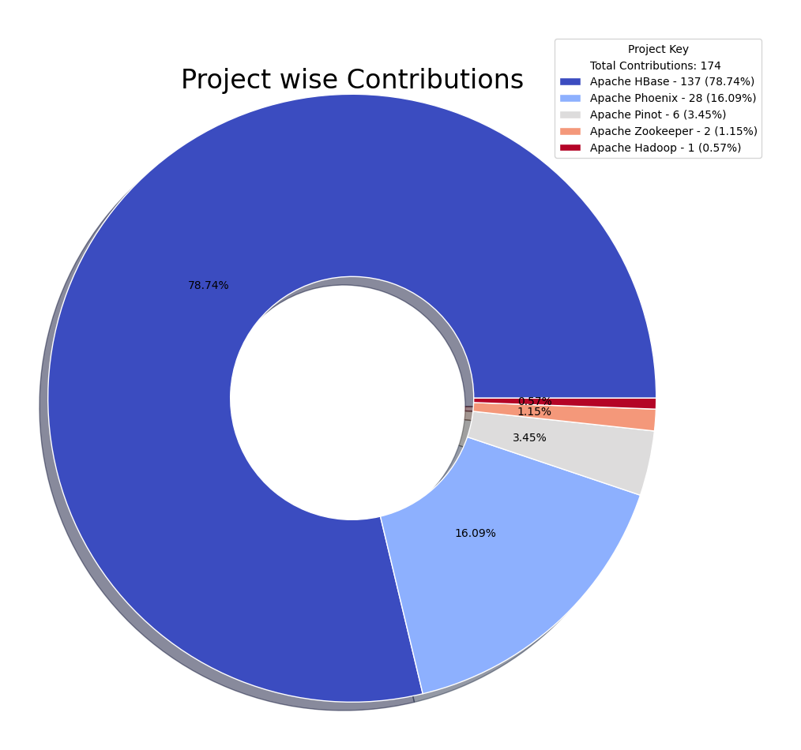

# OpenSource Contributions Report

Report auto-generated on: 2025-04-05 13:15:00

## Overall Summary

| Metric | Value |
|--------|-------|
| Total number of projects | 12 |
| Total number of repositories | 12 |
| Total number of contributions | 167 |
| Number of commits | 157 |
| Number of pull requests (Open) | 10 |

  
  

## Summary of Contributions by each project

| Project Key | Repositories | Users | Commits | Pull Requests (Open) | Overall Contribution |
|--------------|--------------|-------|---------|----------------------|----------------------|
| apache/hbase |  [apache/hbase](https://github.com/apache/hbase) |  [Nihal Jain](https://github.com/NihalJain) | 76 | 5 | 81 |
| NihalJain/opensource-contributions-tracker |  [NihalJain/opensource-contributions-tracker](https://github.com/NihalJain/opensource-contributions-tracker) |  [Nihal Jain](https://github.com/NihalJain) | 17 | 0 | 17 |
| NihalJain/jetty_log_dir_issue |  [NihalJain/jetty_log_dir_issue](https://github.com/NihalJain/jetty_log_dir_issue) |  [Nihal Jain](https://github.com/NihalJain) | 15 | 0 | 15 |
| apache/hbase-operator-tools |  [apache/hbase-operator-tools](https://github.com/apache/hbase-operator-tools) |  [Nihal Jain](https://github.com/NihalJain) | 13 | 0 | 13 |
| apache/phoenix-omid |  [apache/phoenix-omid](https://github.com/apache/phoenix-omid) |  [Nihal Jain](https://github.com/NihalJain) | 10 | 0 | 10 |
| apache/hbase-connectors |  [apache/hbase-connectors](https://github.com/apache/hbase-connectors) |  [Nihal Jain](https://github.com/NihalJain) | 7 | 1 | 8 |
| apache/phoenix |  [apache/phoenix](https://github.com/apache/phoenix) |  [Nihal Jain](https://github.com/NihalJain) | 5 | 2 | 7 |
| apache/hbase-thirdparty |  [apache/hbase-thirdparty](https://github.com/apache/hbase-thirdparty) |  [Nihal Jain](https://github.com/NihalJain) | 5 | 2 | 7 |
| apache/phoenix-queryserver |  [apache/phoenix-queryserver](https://github.com/apache/phoenix-queryserver) |  [Nihal Jain](https://github.com/NihalJain) | 5 | 0 | 5 |
| pinot-contrib/pinot-docs |  [pinot-contrib/pinot-docs](https://github.com/pinot-contrib/pinot-docs) |  [Nihal Jain](https://github.com/NihalJain) | 2 | 0 | 2 |
| apache/hadoop |  [apache/hadoop](https://github.com/apache/hadoop) |  [Nihal Jain](https://github.com/NihalJain) | 1 | 0 | 1 |
| apache/pinot |  [apache/pinot](https://github.com/apache/pinot) |  [Nihal Jain](https://github.com/NihalJain) | 1 | 0 | 1 |

## Summary of Contributions by each user

| User | Repositories | Commits | Pull Requests (Open) | Overall Contribution |
|------|--------------|---------|----------------------|----------------------|
|  [Nihal Jain](https://github.com/NihalJain) |  [NihalJain/jetty_log_dir_issue](https://github.com/NihalJain/jetty_log_dir_issue)  [NihalJain/opensource-contributions-tracker](https://github.com/NihalJain/opensource-contributions-tracker)  [apache/hadoop](https://github.com/apache/hadoop)  [apache/hbase](https://github.com/apache/hbase)  [apache/hbase-connectors](https://github.com/apache/hbase-connectors)  [apache/hbase-operator-tools](https://github.com/apache/hbase-operator-tools)  [apache/hbase-thirdparty](https://github.com/apache/hbase-thirdparty)  [apache/phoenix](https://github.com/apache/phoenix)  [apache/phoenix-omid](https://github.com/apache/phoenix-omid)  [apache/phoenix-queryserver](https://github.com/apache/phoenix-queryserver)  [apache/pinot](https://github.com/apache/pinot)  [pinot-contrib/pinot-docs](https://github.com/pinot-contrib/pinot-docs) | 157 | 10 | 167 |

## Detailed Contributions

| Project Key | Repository | User | Commits | Pull Requests (Open) | Overall Contribution |
|--------------|------------|------|---------|----------------------|----------------------|
| apache/phoenix-omid |  [apache/phoenix-omid](https://github.com/apache/phoenix-omid) |  [Nihal Jain](https://github.com/NihalJain) | 10 | 0 | 10 |
| apache/hbase |  [apache/hbase](https://github.com/apache/hbase) |  [Nihal Jain](https://github.com/NihalJain) | 76 | 5 | 81 |
| apache/pinot |  [apache/pinot](https://github.com/apache/pinot) |  [Nihal Jain](https://github.com/NihalJain) | 1 | 0 | 1 |
| apache/hadoop |  [apache/hadoop](https://github.com/apache/hadoop) |  [Nihal Jain](https://github.com/NihalJain) | 1 | 0 | 1 |
| apache/phoenix |  [apache/phoenix](https://github.com/apache/phoenix) |  [Nihal Jain](https://github.com/NihalJain) | 5 | 2 | 7 |
| apache/hbase-connectors |  [apache/hbase-connectors](https://github.com/apache/hbase-connectors) |  [Nihal Jain](https://github.com/NihalJain) | 7 | 1 | 8 |
| apache/phoenix-queryserver |  [apache/phoenix-queryserver](https://github.com/apache/phoenix-queryserver) |  [Nihal Jain](https://github.com/NihalJain) | 5 | 0 | 5 |
| NihalJain/opensource-contributions-tracker |  [NihalJain/opensource-contributions-tracker](https://github.com/NihalJain/opensource-contributions-tracker) |  [Nihal Jain](https://github.com/NihalJain) | 17 | 0 | 17 |
| pinot-contrib/pinot-docs |  [pinot-contrib/pinot-docs](https://github.com/pinot-contrib/pinot-docs) |  [Nihal Jain](https://github.com/NihalJain) | 2 | 0 | 2 |
| apache/hbase-thirdparty |  [apache/hbase-thirdparty](https://github.com/apache/hbase-thirdparty) |  [Nihal Jain](https://github.com/NihalJain) | 5 | 2 | 7 |
| NihalJain/jetty_log_dir_issue |  [NihalJain/jetty_log_dir_issue](https://github.com/NihalJain/jetty_log_dir_issue) |  [Nihal Jain](https://github.com/NihalJain) | 15 | 0 | 15 |
| apache/hbase-operator-tools |  [apache/hbase-operator-tools](https://github.com/apache/hbase-operator-tools) |  [Nihal Jain](https://github.com/NihalJain) | 13 | 0 | 13 |
